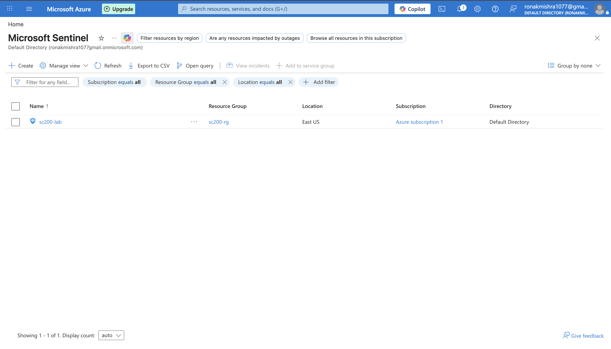
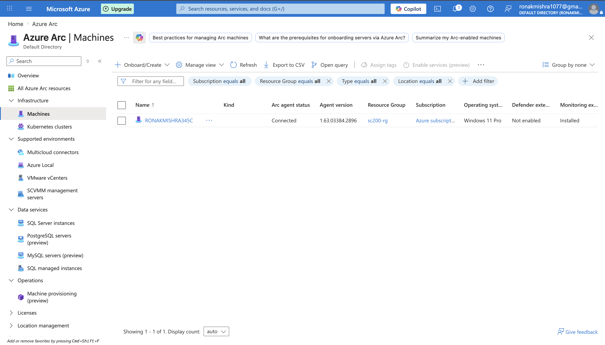
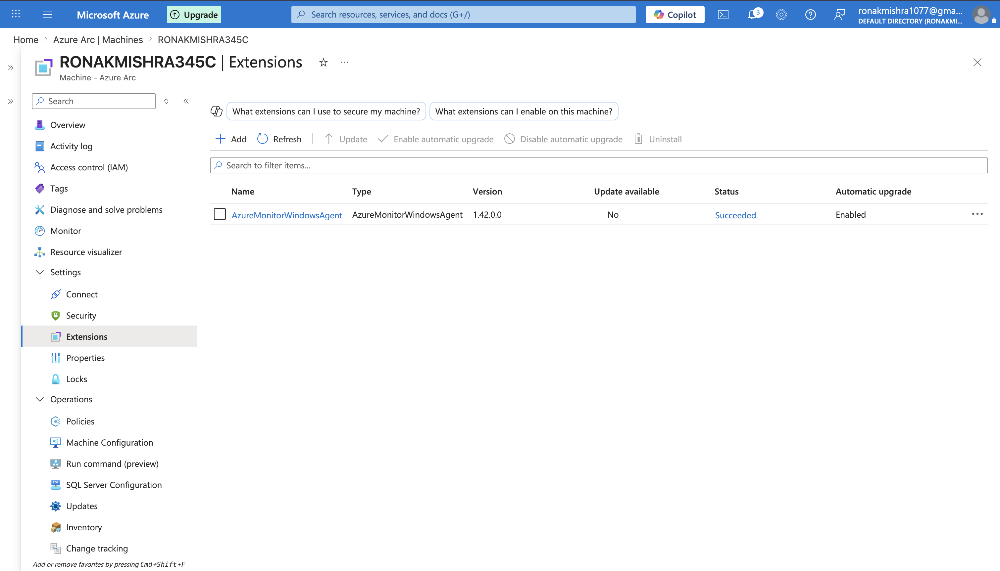
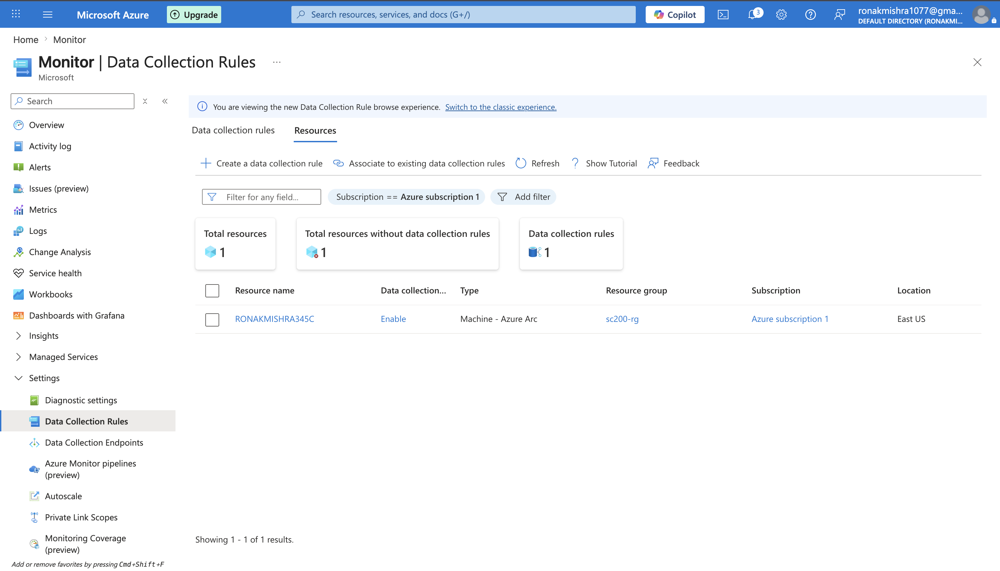
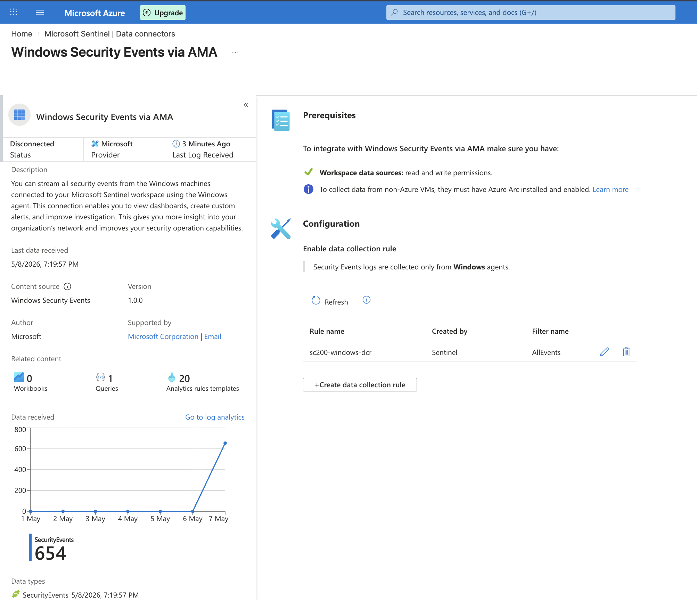
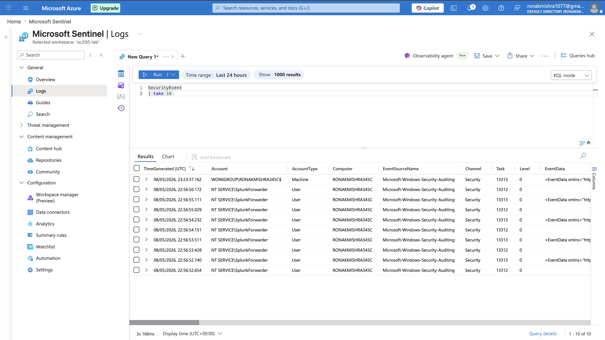
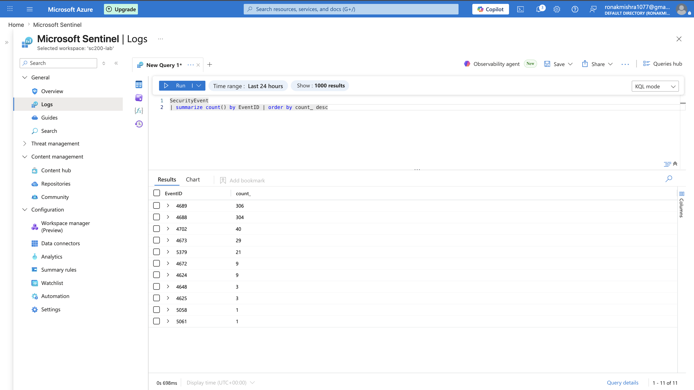
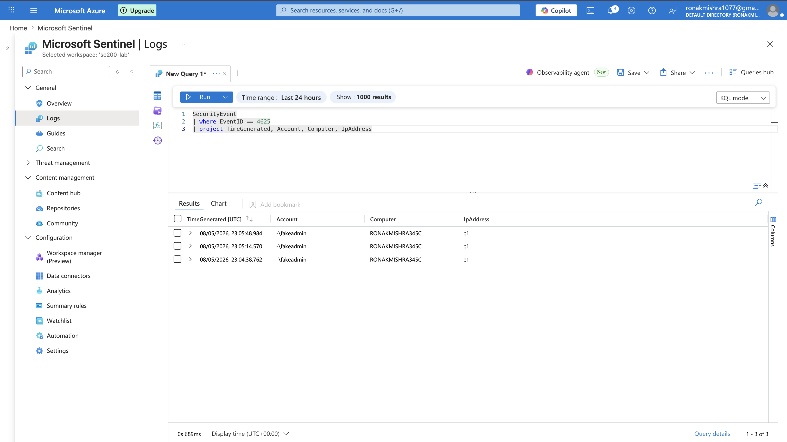
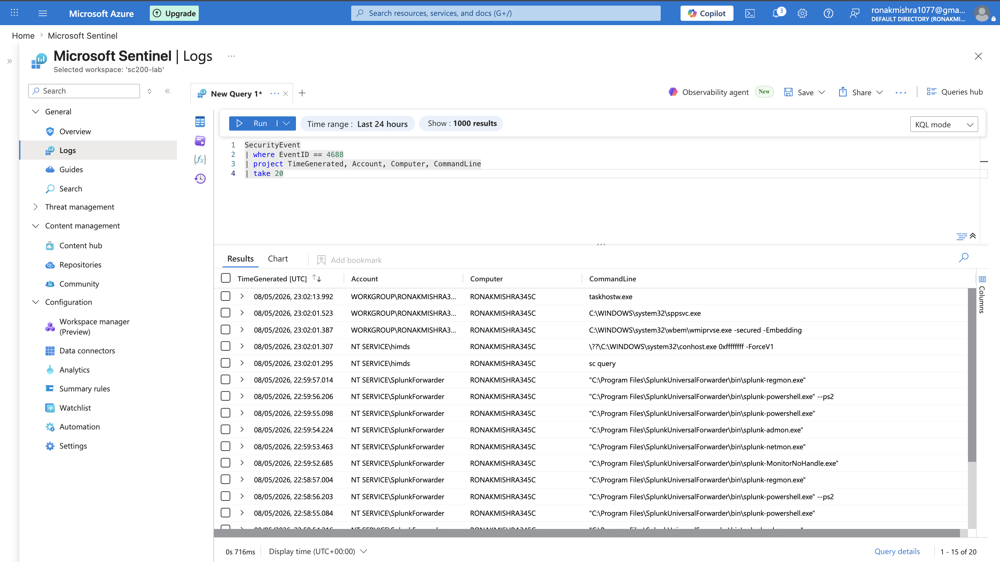
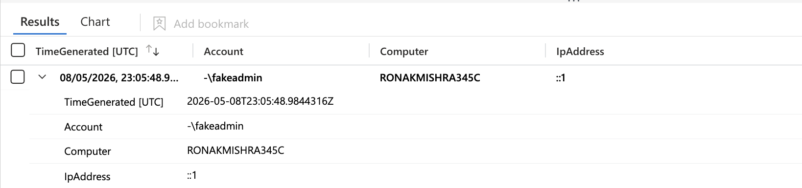

# Day 1 — Environment Setup & Windows Endpoint

## Overview
Day 1 covers the complete setup of the Microsoft Sentinel SIEM environment from scratch. This includes deploying the Sentinel workspace in Azure, connecting the Windows 11 Enterprise VM to Azure via Azure Arc, installing the Azure Monitor Agent, configuring a Data Collection Rule to collect Windows Security Events, and verifying that logs are flowing into Sentinel. The day ends with the first KQL queries and a simulated brute force attack detection.

---

## What Was Built

| Component | Details |
|-----------|---------|
| SIEM Platform | Microsoft Sentinel on Log Analytics Workspace (sc200-lab) |
| Resource Group | sc200-rg (East US) |
| First Endpoint | Windows 11 Enterprise — RONAKMISHRA345C (10.0.0.32) |
| Data Source | Windows Security Events via Azure Monitor Agent |
| Data Collection Rule | sc200-windows-dcr |

---

## Step-by-Step Walkthrough

### Step 1 — Deploy Microsoft Sentinel Workspace
The first step is creating a Log Analytics Workspace and enabling Microsoft Sentinel on top of it. Sentinel does not store data itself — it uses Log Analytics as its underlying database. All logs, queries, and analytics rules run against this workspace.

**Why this matters:** Every SOC analyst working with Sentinel needs to understand that the workspace is the foundation. When you run KQL queries, you are querying the Log Analytics database. When Sentinel detects threats, it reads from the same database.


> Microsoft Sentinel workspace sc200-lab deployed successfully in resource group sc200-rg, East US region.

---

### Step 2 — Connect Windows VM to Azure Arc
The Windows 11 Enterprise VM runs locally inside Parallels on a MacBook. Azure has no knowledge of this machine by default. Azure Arc is a service that registers on-premises and non-Azure machines into Azure, giving them an Azure identity and allowing Azure services to manage and monitor them.

**Why this matters:** In real enterprise environments, most servers are on-premises, not in Azure. Azure Arc is how organizations connect their existing infrastructure to Azure security tools like Sentinel without migrating to the cloud. This is a core hybrid cloud skill.


> Windows 11 Enterprise VM (RONAKMISHRA345C) successfully registered in Azure Arc. Status shows Connected.

---

### Step 3 — Install Azure Monitor Agent
Once the VM is registered in Azure Arc, the Azure Monitor Agent (AMA) is deployed to the VM. AMA is a lightweight background service that runs on the endpoint and collects the logs defined by the Data Collection Rule. Without AMA, no logs flow into Sentinel.

**Why this matters:** AMA replaced the older Log Analytics Agent (MMA). Understanding AMA is essential because it is the current standard for log collection in Microsoft environments. Every endpoint you want to monitor must have AMA installed.


> Azure Monitor Windows Agent installed successfully on RONAKMISHRA345C. Extension status shows Succeeded.

---

### Step 4 — Configure Data Collection Rule
A Data Collection Rule (DCR) tells AMA exactly what to collect and where to send it. The sc200-windows-dcr rule instructs AMA to collect Windows Security Events from the Windows VM and send them to the sc200-lab Log Analytics workspace.

**Why this matters:** DCRs are the configuration layer of the log pipeline. You can have multiple DCRs for different data sources — one for Windows Security Events, one for Linux Syslog, one for performance counters. Understanding DCRs is essential for configuring what gets monitored.


> Data Collection Rule sc200-windows-dcr configured to collect Windows Security Events from RONAKMISHRA345C and send to sc200-lab workspace.

---

### Step 5 — Connect Windows Security Events Connector
In addition to the DCR, the Windows Security Events via AMA connector is enabled in Sentinel's Content Hub. This connector provides built-in parsing and table mapping so that Windows Security Event logs appear in the SecurityEvent table in Log Analytics.

**Why this matters:** Sentinel data connectors are how different data sources get ingested. The connector handles the normalization of raw log data into structured tables that KQL can query efficiently.


> Windows Security Events via AMA connector enabled in Microsoft Sentinel. Status shows Connected.

---

### Step 6 — Verify First Logs in Sentinel
After the pipeline is configured, the first verification step is confirming that logs are actually flowing into Sentinel. This is done by running a simple KQL query against the SecurityEvent table.

**Why this matters:** Never assume the pipeline is working. Always verify. In real SOC environments, broken log pipelines are a common issue and a gap in coverage means missed detections.


> SecurityEvent table showing live Windows security events from RONAKMISHRA345C flowing into Sentinel. Log pipeline confirmed working.

---

### Step 7 — KQL Query 1: Event Summary by EventID
The first KQL query summarizes all Windows Security Events by EventID to understand what types of events are being collected. This gives a baseline view of the security event landscape on the endpoint.

```kql
SecurityEvent
| summarize Count = count() by EventID, Activity
| order by Count desc
```


> KQL query returning all SecurityEvent EventIDs with counts. Shows distribution of event types including logon events, process creation, and privilege assignment.

---

### Step 8 — KQL Query 2: Failed Logon Detection
The second KQL query specifically filters for EventID 4625 (failed logon) events. This is one of the most fundamental detection queries in Windows security monitoring and forms the basis of brute force detection.

```kql
SecurityEvent
| where EventID == 4625
| where TimeGenerated > ago(24h)
| project TimeGenerated, Account, Computer, IpAddress
| order by TimeGenerated desc
```

**EventID 4625** is generated every time a Windows logon attempt fails. Key fields:
- Account — which account was targeted
- IpAddress — where the attempt came from
- Logon Type — 3 = network logon (RDP/SMB), 2 = interactive


> KQL query showing EventID 4625 failed logon events. Source IP and targeted account visible for each attempt.

---

### Step 9 — KQL Query 3: Process Creation Detection
The third query filters for EventID 4688 (process creation) events. This captures every command executed on the Windows endpoint including the full command line, which is critical for detecting post-exploitation reconnaissance.

```kql
SecurityEvent
| where EventID == 4688
| where TimeGenerated > ago(24h)
| project TimeGenerated, Account, Computer, NewProcessName, CommandLine
| order by TimeGenerated desc
```

**EventID 4688** is generated every time a new process starts. Key fields:
- NewProcessName — the executable that was launched
- CommandLine — the full command with arguments
- Account — which user ran it


> KQL query showing EventID 4688 process creation events with full command line visible. Foundation for detecting suspicious command execution.

---

### Step 10 — Simulated Brute Force Detected
A simulated brute force attack is performed against the Windows VM using the net use command to generate multiple failed logon attempts (EventID 4625). These events appear immediately in Sentinel confirming end-to-end detection capability.


> Multiple EventID 4625 failed logon events detected in Sentinel following simulated brute force. Source IP and targeted account confirmed visible in logs.

---

## Key Concepts Learned

- Microsoft Sentinel is built on top of Log Analytics — all data lives in Log Analytics tables
- Azure Arc registers on-premises machines into Azure without migrating them to the cloud
- Azure Monitor Agent (AMA) is the log collection agent deployed to each monitored endpoint
- Data Collection Rules define what gets collected and where it gets sent
- KQL (Kusto Query Language) is used to query all data in Sentinel
- EventID 4625 = failed logon, EventID 4688 = process creation — two of the most important Windows Security EventIDs

## MITRE ATT&CK
- T1110 — Brute Force (simulated and detected via EventID 4625)
