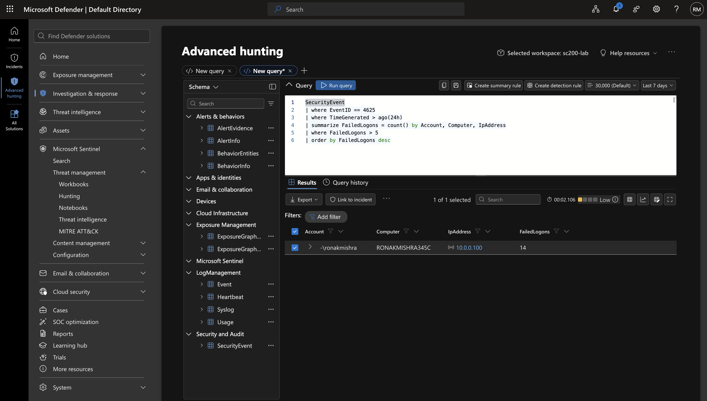
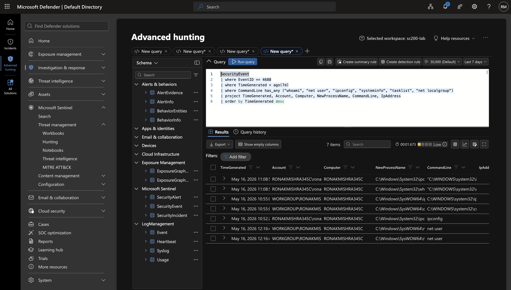
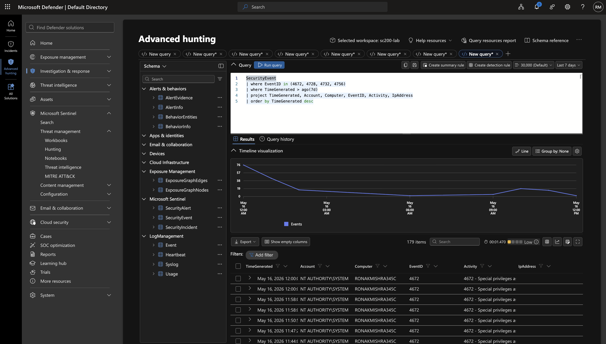
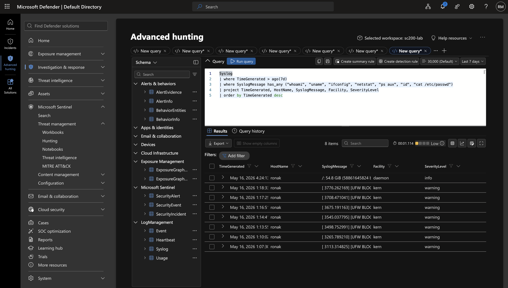
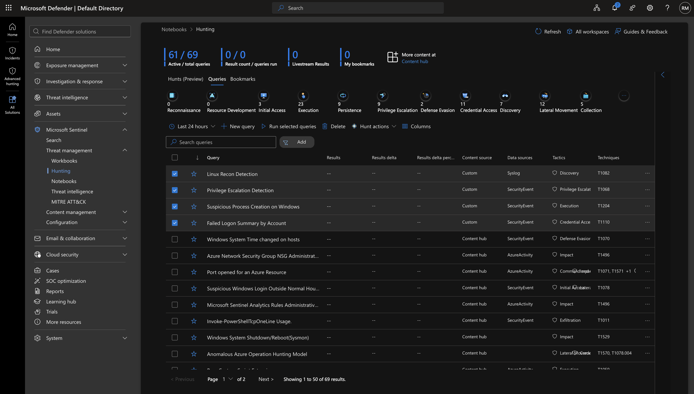

# Day 5 — KQL Threat Hunting

## Overview
Day 5 focuses on proactive threat hunting using custom KQL queries in Microsoft Sentinel's Hunting feature. While analytics rules are reactive (they wait for thresholds to be exceeded), threat hunting is proactive — assuming attackers may already be present and searching for indicators of compromise that haven't triggered automated alerts. Four custom hunting queries are built covering credential access, execution, privilege escalation, and discovery tactics.

---

## Reactive vs Proactive Security

| Approach | Method | When It Triggers |
|----------|--------|-----------------|
| Reactive | Analytics Rules | When attack threshold is exceeded |
| Proactive | Threat Hunting | Analyst-initiated, any time |

**Threat hunting hypothesis:** "What if an attacker is present but staying below our detection thresholds? What if they're using legitimate tools to blend in?"

---

## Hunting Queries Built

| Query | Tactic | Technique | Data Source |
|-------|--------|-----------|-------------|
| Failed Logon Summary by Account | Credential Access | T1110 | SecurityEvent |
| Suspicious Process Creation on Windows | Execution | T1204 | SecurityEvent |
| Privilege Escalation Detection | Privilege Escalation | T1068 | SecurityEvent |
| Linux Recon Detection | Discovery | T1082 | Syslog |

---

## Step-by-Step Walkthrough

### Step 1 — Hunting Query 1: Failed Logon Summary by Account
This query hunts for accounts with an unusual number of failed login attempts over the past 24 hours. Unlike the analytics rule which fires when a threshold is hit, this hunting query lets the analyst manually review the full picture of failed authentication activity.

```kql
SecurityEvent
| where EventID == 4625
| where TimeGenerated > ago(24h)
| summarize FailedLogons = count() by Account, Computer, IpAddress
| where FailedLogons > 5
| order by FailedLogons desc
```

**What to look for:**
- Multiple accounts being targeted from the same IP (password spraying)
- One account with an unusually high failure count (targeted brute force)
- Internal IPs generating failures (lateral movement attempt)

**MITRE ATT&CK:** T1110 — Brute Force

**Results from lab:** ronakmishra account showed 14 failed logons from 10.0.0.100 — consistent with the RDP brute force simulation from Day 4.


> Custom hunting query results showing failed logon summary by account. ronakmishra account shows 14 failures from 10.0.0.100 — consistent with RDP brute force activity.

---

### Step 2 — Hunting Query 2: Suspicious Process Creation on Windows
This query hunts for reconnaissance and discovery commands executed on Windows endpoints by searching EventID 4688 process creation events for known suspicious command names.

```kql
SecurityEvent
| where EventID == 4688
| where TimeGenerated > ago(7d)
| where CommandLine has_any ("whoami", "net user", "ipconfig", "systeminfo", "tasklist", "net localgroup")
| project TimeGenerated, Account, Computer, NewProcessName, CommandLine, IpAddress
| order by TimeGenerated desc
```

**What to look for:**
- Recon commands run in quick succession (attacker pattern)
- Commands run by SYSTEM or service accounts (unusual)
- Commands run outside business hours (suspicious timing)
- Commands run from unusual parent processes (living off the land)

**MITRE ATT&CK:** T1204 — User Execution

**Results from lab:** whoami, ipconfig, and net user executions from Day 4 simulation confirmed in results.


> Custom hunting query showing suspicious process creation events. whoami, ipconfig, and net user commands visible with full command line and account context.

---

### Step 3 — Hunting Query 3: Privilege Escalation Detection
This query hunts for privilege escalation activity by monitoring EventIDs related to special privilege assignments and group membership changes. These events occur when attackers elevate their access or add themselves to privileged groups.

```kql
SecurityEvent
| where EventID in (4672, 4728, 4732, 4756)
| where TimeGenerated > ago(7d)
| project TimeGenerated, Account, Computer, EventID, Activity, IpAddress
| order by TimeGenerated desc
```

**EventID breakdown:**
- 4672 — Special privileges assigned to new logon (admin-level access)
- 4728 — Member added to security-enabled global group
- 4732 — Member added to security-enabled local group
- 4756 — Member added to security-enabled universal group

**What to look for:**
- Unknown or service accounts receiving special privileges (4672)
- Users added to Domain Admins or local Administrators groups (4728/4732)
- Changes occurring outside business hours or by unexpected accounts

**MITRE ATT&CK:** T1068 — Exploitation for Privilege Escalation

**Results from lab:** 179 EventID 4672 events returned — primarily NT AUTHORITY\SYSTEM normal system operations, confirming the baseline and demonstrating the query catches all privilege assignment activity.


> Custom hunting query returning 179 privilege escalation events. EventID 4672 (special privileges assigned) visible with account and computer context. Baseline established for anomaly detection.

---

### Step 4 — Hunting Query 4: Linux Recon Detection
This query hunts for reconnaissance activity on the Ubuntu Linux endpoint by searching Syslog messages for common discovery commands. Unlike Windows where EventID 4688 captures process creation, Linux recon detection relies on Syslog entries.

```kql
Syslog
| where TimeGenerated > ago(7d)
| where SyslogMessage has_any ("whoami", "uname", "ifconfig", "netstat", "ps aux", "id", "cat /etc/passwd")
| project TimeGenerated, HostName, SyslogMessage, Facility, SeverityLevel
| order by TimeGenerated desc
```

**Common Linux recon commands and what they reveal:**
- `whoami` / `id` — current user and group memberships
- `uname -a` — OS version and kernel version (identifies exploitable vulnerabilities)
- `ifconfig` / `ip addr` — network interfaces and IP addresses
- `netstat` — active network connections (identifies other systems to pivot to)
- `ps aux` — running processes (identifies security tools to evade)
- `cat /etc/passwd` — list of all user accounts on the system

**MITRE ATT&CK:** T1082 — System Information Discovery


> Custom hunting query scanning Syslog for Linux reconnaissance commands. Query ready to detect post-exploitation discovery activity on Ubuntu endpoint.

---

### Step 5 — All Custom Hunting Queries Saved
All four custom hunting queries are saved in Sentinel's Hunting library. They appear alongside the built-in Microsoft hunting queries and can be run on demand by any SOC analyst investigating suspicious activity.


> Sentinel Hunting page showing all four custom queries saved — Failed Logon Summary by Account, Suspicious Process Creation on Windows, Privilege Escalation Detection, and Linux Recon Detection. All available for on-demand hunting.

---

## Key Concepts Learned

- Threat hunting is proactive — it assumes attackers may be present and searches for them before alerts fire
- The difference between hunting and detection: hunting is hypothesis-driven and analyst-initiated, detection is automated and threshold-based
- EventID 4672 fires constantly for SYSTEM — establish a baseline before alerting on privilege events
- Linux recon detection via Syslog requires different techniques than Windows (no process creation EventID equivalent)
- The has_any operator is essential for hunting — it matches any word from a list in a single efficient query
- Saving hunting queries builds an organizational knowledge base that future analysts can reuse
- Threat hunting results feed back into analytics rule development — if hunting finds something, build a rule to detect it automatically

## MITRE ATT&CK Coverage
- T1110 — Brute Force (Credential Access)
- T1204 — User Execution (Execution)
- T1068 — Exploitation for Privilege Escalation (Privilege Escalation)
- T1082 — System Information Discovery (Discovery)
