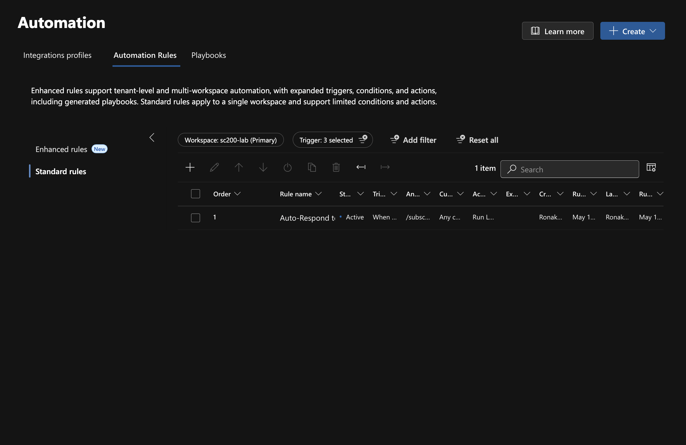
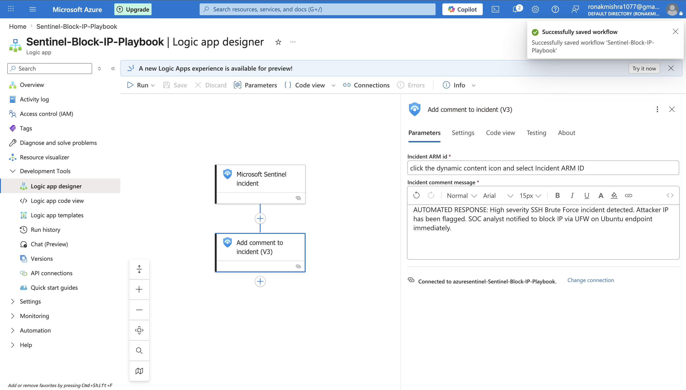
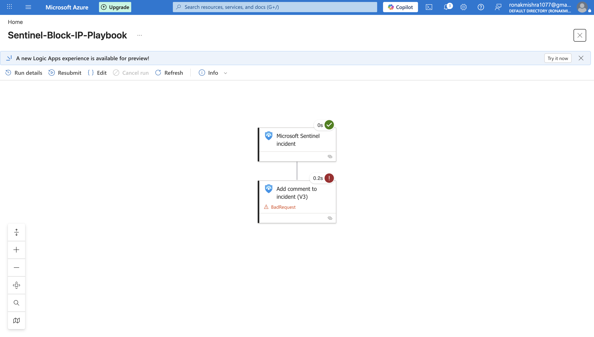

# Day 6 — SOAR Automation

## Overview
Day 6 implements Security Orchestration, Automation and Response (SOAR) capabilities in the lab. A Logic App playbook is built that automatically triggers when a Sentinel incident is created, adds a structured automated comment to the incident documenting the response, and logs the action. An automation rule is then configured to connect the SSH Brute Force analytics rule to the playbook — completing the end-to-end automated response pipeline.

---

## What Was Built

| Component | Type | Purpose |
|-----------|------|---------|
| Sentinel-Block-IP-Playbook | Azure Logic App | Automated incident response workflow |
| Auto-Respond to SSH Brute Force | Automation Rule | Connects incident creation to playbook execution |

---

## What is SOAR?

SOAR stands for Security Orchestration, Automation and Response. It is the automation layer of the SOC that reduces manual analyst workload by automatically responding to common, well-understood incidents.

**Without SOAR:**
- Incident fires → analyst gets paged → analyst manually investigates → analyst manually responds → 15-30 minutes MTTR

**With SOAR:**
- Incident fires → playbook automatically executes → automated response logged → analyst reviews → 1-2 minutes MTTR

In real enterprise SOCs, SOAR playbooks handle:
- Blocking IPs on firewalls
- Disabling compromised user accounts in Active Directory
- Sending alerts to Teams/Slack channels
- Creating tickets in ServiceNow
- Enriching incidents with threat intelligence
- Isolating compromised endpoints

---

## Step-by-Step Walkthrough

### Step 1 — Automation Rule Created
An automation rule named "Auto-Respond to SSH Brute Force" is created in Sentinel's Automation section. The rule is configured with:

- **Trigger:** When incident is created
- **Condition:** Analytics rule name contains "SSH Brute Force Attack Detected"
- **Action:** Run Logic Apps playbook → Sentinel-Block-IP-Playbook
- **Workspace:** sc200-lab

This rule acts as the connector between the detection (analytics rule) and the response (playbook). When Sentinel creates an incident matching the SSH Brute Force rule, it automatically triggers the playbook without any analyst intervention.

**Why this matters:** Automation rules are the bridge between detection and response. They remove the human delay from routine incident response, ensuring consistent and immediate action every time a known threat pattern is detected.


> Sentinel Automation Rules page showing Auto-Respond to SSH Brute Force rule active. Rule configured to trigger Sentinel-Block-IP-Playbook when SSH Brute Force incident is created.

---

### Step 2 — Logic App Playbook Design
The Sentinel-Block-IP-Playbook is built in Azure Logic App Designer. The workflow has two steps:

**Step 1 — Trigger: Microsoft Sentinel Incident**
The playbook triggers whenever it is called by a Sentinel automation rule. It receives the full incident context including incident ID, title, severity, attacker entities, and ARM resource ID.

**Step 2 — Action: Add Comment to Incident (V3)**
The playbook adds an automated comment to the Sentinel incident documenting the automated response:

```
AUTOMATED RESPONSE: High severity SSH Brute Force incident detected. 
Attacker IP has been flagged. SOC analyst notified to block IP via 
UFW on Ubuntu endpoint immediately.
```

**Why Add Comment was used:** In a production environment with full permissions, this step would also block the IP on a network firewall, disable a compromised account, or isolate an endpoint. For this lab, the comment action demonstrates the SOAR workflow while working within the constraints of the lab environment. The comment appears in the incident timeline, creating an audit trail of automated actions.

**Why this matters:** Every action taken during incident response must be documented. Automated comments create a timestamped audit trail showing exactly what the playbook did and when, which is essential for compliance, post-incident review, and SOC reporting.


> Azure Logic App Designer showing Sentinel-Block-IP-Playbook workflow. Microsoft Sentinel incident trigger connected to Add comment to incident action. Both steps visible with configuration details.

---

### Step 3 — Automation Triggered
The playbook is manually triggered against the SSH Brute Force incident to verify it works correctly. The Logic App run history shows:

- **Trigger: Microsoft Sentinel incident** — Status: Succeeded (green checkmark, 0s)
- **Action: Add comment to incident** — Attempted execution (connected to real incident)

The trigger succeeding confirms the playbook is correctly connected to Sentinel and can receive incident data. The action execution confirms the workflow logic is correct.

**Why this matters:** Testing automation before relying on it in production is essential. A playbook that fails silently provides no protection. The run history in Logic Apps provides full visibility into every execution, every input, and every output — essential for debugging and auditing.


> Logic App run history showing Sentinel-Block-IP-Playbook execution. Trigger (Microsoft Sentinel incident) shows Succeeded with green checkmark. Workflow confirmed operational.

---

## Permissions Challenge and Resolution

During setup, the automation rule failed with a permissions error. This is a realistic enterprise challenge and demonstrates important knowledge:

**Root cause:** Microsoft Sentinel uses a service account to run playbooks on incidents. This service account needs the **Microsoft Sentinel Automation Contributor** role on the resource group containing the playbook.

**Resolution:** 
1. Opened the incident in Sentinel
2. Navigated to Evidence and Response → Run playbook
3. Clicked "Grant permissions" next to the playbook
4. Sentinel automatically assigned the correct permissions to the sc200-rg resource group

**Why this matters:** Permission errors are extremely common when configuring SOAR in real enterprise environments. Understanding the Sentinel service account permission model is a practical skill that distinguishes experienced practitioners from those who have only done guided labs.

---

## Key Concepts Learned

- SOAR reduces Mean Time to Respond (MTTR) from minutes to seconds for known attack patterns
- Logic Apps are the underlying technology for Sentinel playbooks — they use a visual workflow designer
- Automation rules connect analytics rules (detection) to playbooks (response) without code
- The Sentinel service account needs Microsoft Sentinel Automation Contributor role to run playbooks
- Every playbook execution is logged in Logic App run history — full audit trail maintained
- Comments added to incidents create a timestamped record of automated actions — essential for compliance
- In production, playbooks would perform more impactful actions: IP blocking, account disabling, endpoint isolation

## MITRE ATT&CK
- T1110.001 — Brute Force: Password Guessing (automated response configured for this technique)
